# imaping-token 架构图表集

> **文档版本**: v1.0
> **最后更新**: 2025-10-11
> **说明**: 本文档包含 imaping-token 系统的各种架构图表,使用 Mermaid 图表语言

---

## 目录

- [1. 模块依赖图](#1-模块依赖图)
- [2. Token 类型层次结构](#2-token-类型层次结构)
- [3. TokenRegistry 实现层次](#3-tokenregistry-实现层次)
- [4. Token 创建流程](#4-token-创建流程)
- [5. Token 验证流程](#5-token-验证流程)
- [6. 自动配置加载顺序](#6-自动配置加载顺序)
- [7. 部署架构](#7-部署架构)

---

## 1. 模块依赖图

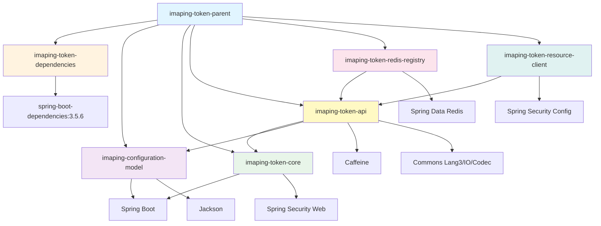

**说明**:
- **蓝色**: 父 POM
- **橙色**: 依赖管理模块
- **紫色**: 配置模型
- **绿色**: 核心模块
- **黄色**: API 模块
- **粉色**: Redis 实现
- **青色**: 资源客户端

---

## 2. Token 类型层次结构

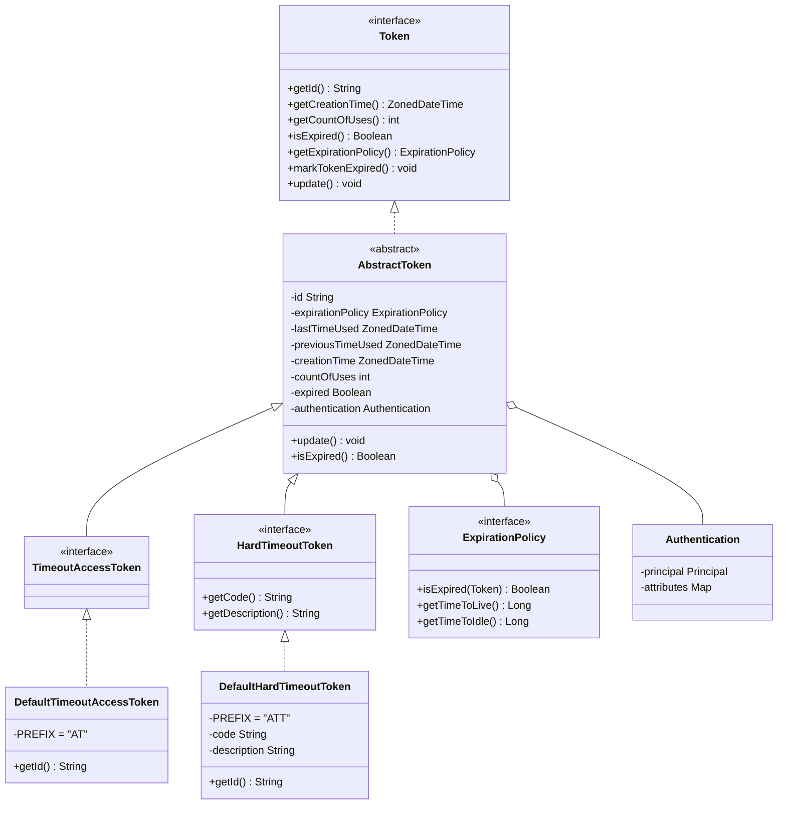

**关键点**:
- `Token`: 顶层接口,定义基本契约
- `AbstractToken`: 抽象基类,封装通用逻辑
- `DefaultTimeoutAccessToken`: 自动续期 Token (PREFIX="AT")
- `DefaultHardTimeoutToken`: 固定时间 Token (PREFIX="ATT")

---

## 3. TokenRegistry 实现层次

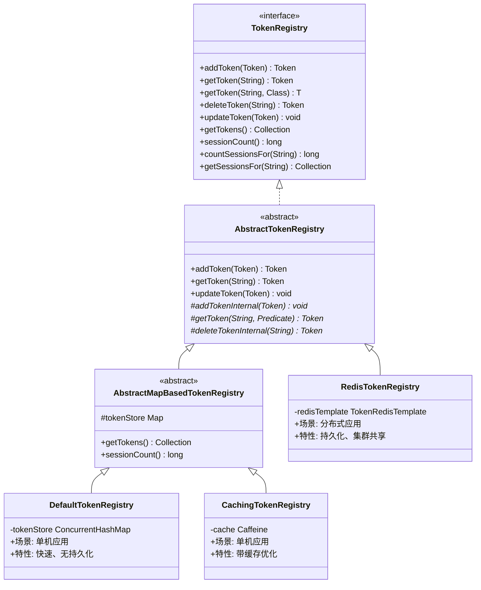

**存储对比**:

| 实现类 | 存储 | 场景 | 持久化 | 集群 |
|--------|------|------|--------|------|
| DefaultTokenRegistry | ConcurrentHashMap | 单机 | ❌ | ❌ |
| CachingTokenRegistry | Caffeine | 单机 | ❌ | ❌ |
| RedisTokenRegistry | Redis | 分布式 | ✅ | ✅ |

---

## 4. Token 创建流程

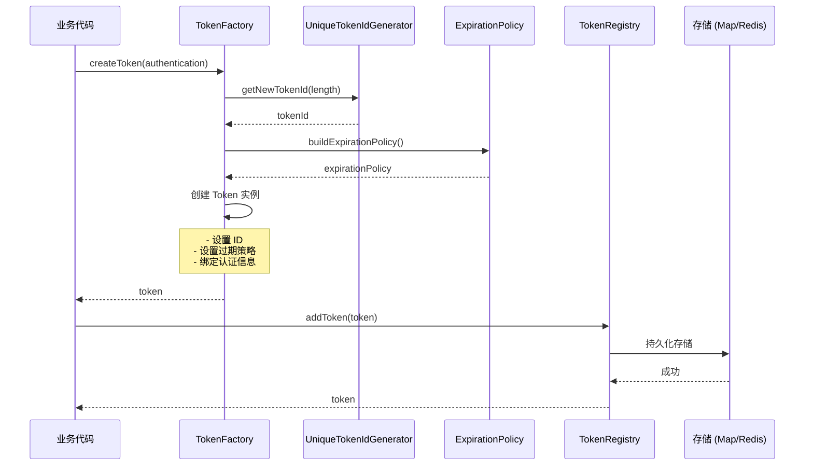

**关键步骤**:
1. 业务代码调用 `TokenFactory.createToken(authentication)`
2. 生成唯一 Token ID
3. 构建过期策略
4. 创建 Token 实例并设置属性
5. 添加到 `TokenRegistry`
6. 持久化到存储 (内存或 Redis)

---

## 5. Token 验证流程

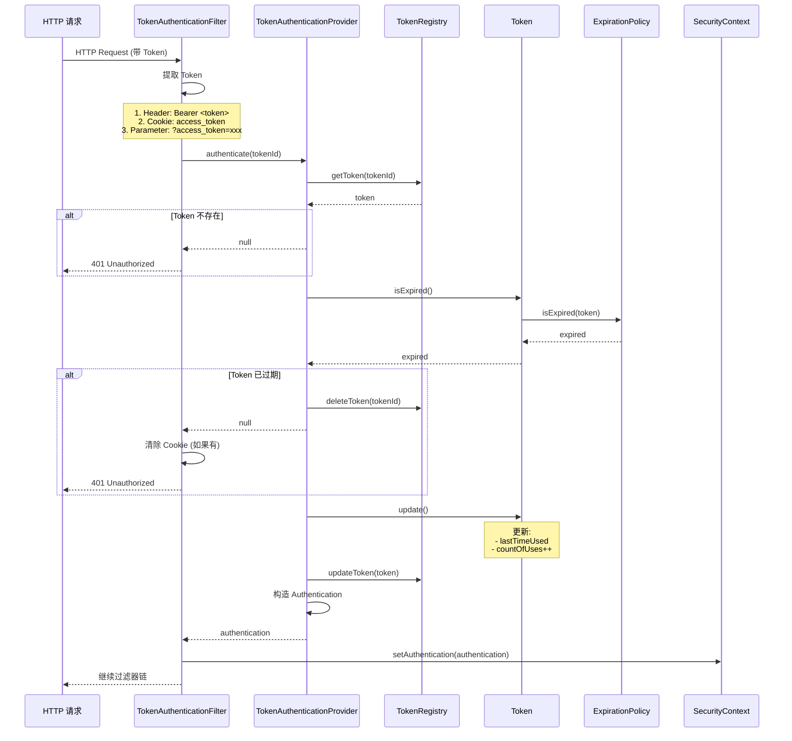

**验证流程**:
1. ✅ 提取 Token (Header > Cookie > Parameter)
2. ✅ 从 TokenRegistry 获取 Token
3. ✅ 验证过期状态
4. ✅ 更新使用统计
5. ✅ 构造 Authentication
6. ✅ 设置到 SecurityContext

**失败处理**:
- ❌ Token 不存在 → 401
- ❌ Token 已过期 → 删除 Token + 清除 Cookie → 401

---

## 6. 自动配置加载顺序

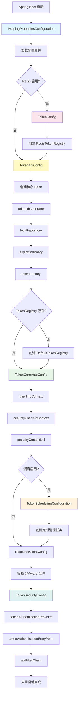

**加载顺序说明**:

1. **IMapingPropertiesConfiguration**
   - 加载 `@ConfigurationProperties("imaping")`

2. **TokenConfig** (@AutoConfigureBefore TokenApiConfig)
   - 条件创建 `RedisTokenRegistry` (如果 `imaping.token.registry.redis.enabled=true`)

3. **TokenApiConfig** (@AutoConfigureBefore TokenCoreAutoConfig)
   - 创建核心 Bean: `tokenIdGenerator`, `lockRepository`, `expirationPolicy`, `tokenFactory`
   - 如果 `TokenRegistry` 不存在,创建 `DefaultTokenRegistry`

4. **TokenCoreAutoConfig**
   - 创建用户上下文相关 Bean

5. **TokenSchedulingConfiguration**
   - 创建定时清理任务 (如果启用)

6. **ResourceClientConfig**
   - 扫描 @Aware 组件

7. **TokenSecurityConfig**
   - 创建 Spring Security 配置

---

## 7. 部署架构

### 7.1 单机部署

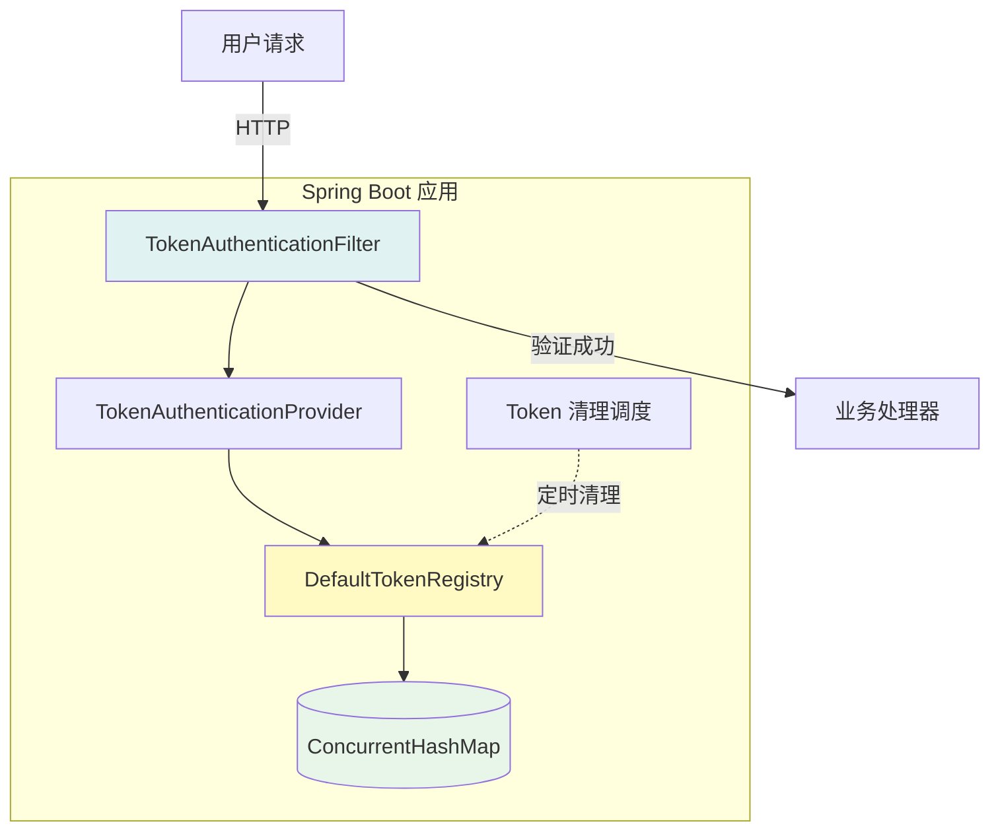

**特点**:
- ✅ 简单部署
- ✅ 低延迟
- ❌ 无法集群共享
- ❌ 重启丢失数据

### 7.2 分布式部署

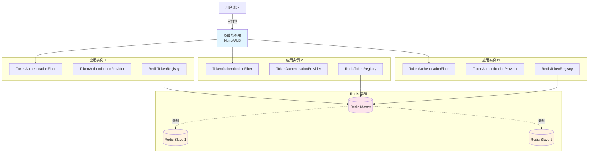

**特点**:
- ✅ 集群共享 Token
- ✅ 高可用
- ✅ Redis TTL 自动过期
- ✅ 持久化
- ❌ Redis 依赖
- ❌ 网络延迟

### 7.3 网络拓扑

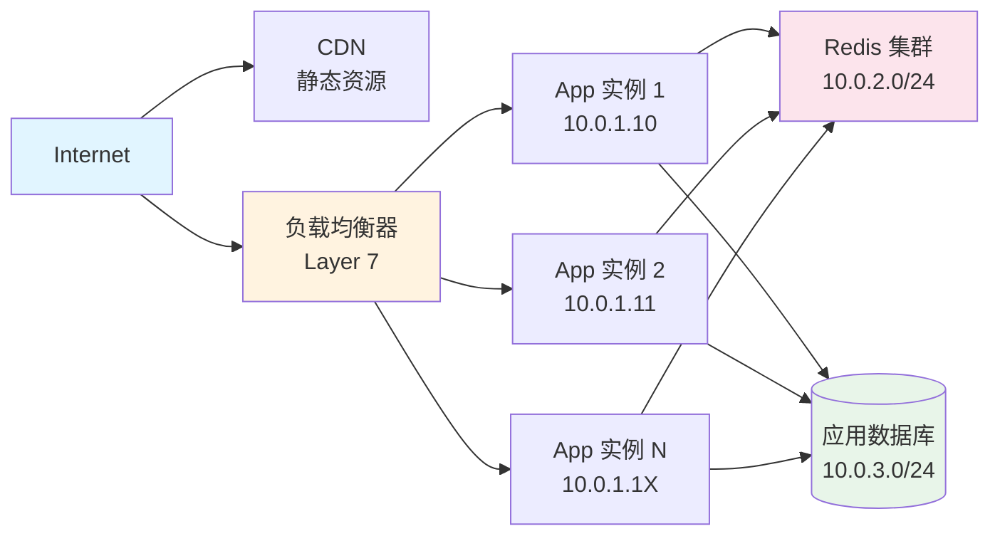

**网络分区**:
- **公网**: CDN + 负载均衡器
- **应用层**: `10.0.1.0/24`
- **缓存层**: `10.0.2.0/24` (Redis)
- **数据层**: `10.0.3.0/24` (数据库)

---

## 8. Token 过期策略对比

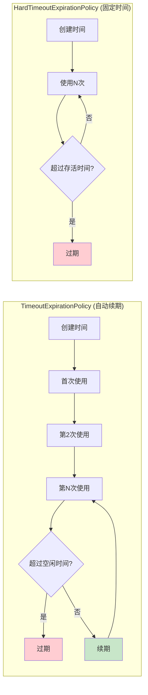

**对比表**:

| 策略 | 判断依据 | 续期 | 适用场景 |
|------|----------|------|----------|
| **TimeoutExpirationPolicy** | `lastTimeUsed + timeToIdle < now` | ✅ 每次使用自动续期 | 用户会话 |
| **HardTimeoutExpirationPolicy** | `creationTime + timeToLive < now` | ❌ 固定时间失效 | 验证码、临时链接 |

---

## 9. 组件交互图

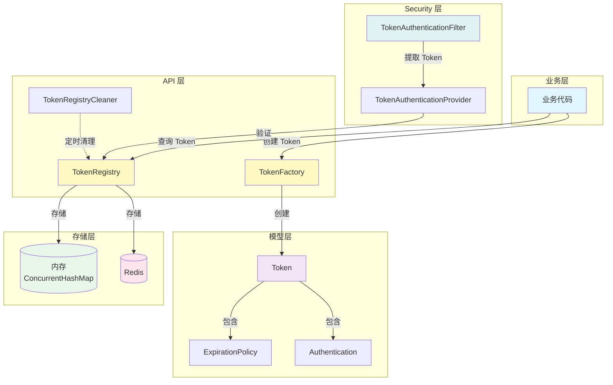

---

## 10. 扩展点架构

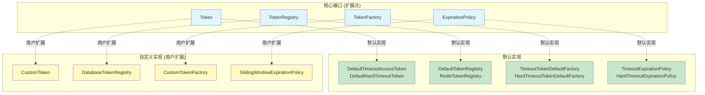

**扩展点**:
1. **Token**: 自定义 Token 类型 (如 RefreshToken)
2. **TokenRegistry**: 自定义存储后端 (如数据库)
3. **TokenFactory**: 自定义 Token 创建逻辑
4. **ExpirationPolicy**: 自定义过期策略 (如滑动窗口)

---

## 变更记录

| 版本 | 日期 | 作者 | 变更内容 |
|------|------|------|----------|
| v1.0 | 2025-10-11 | Architecture Team | 初始版本 - 架构图表集 |

---

**文档位置**: [`docs/architecture-diagrams.md`](architecture-diagrams.md)
